# 🧭 Documentação Técnica - Projeto AWS API Gateway com Lambda & RDS

Este guia tem como objetivo demonstrar o processo completo de criação de uma aplicação utilizando **AWS Lambda**, **Amazon API Gateway** e **Amazon RDS (MySQL)**, com deploy de funções serverless capazes de manipular dados em um banco relacional na nuvem.

---

## 🗂️ Sumário

1.   
2. [⚙️ Setup de Ambiente e Dependências Lambda](https://github.com/ricardofsilva7/API-GATEWAY#2---%EF%B8%8F-setup-do-ambiente-lambda-e-depend%C3%AAncias)  
3. [📦 Criação e Deploy da Função Lambda](https://github.com/ricardofsilva7/API-GATEWAY#3----cria%C3%A7%C3%A3o-e-deploy-da-fun%C3%A7%C3%A3o-lambda)  
4. [🔗 Conexão Lambda ↔️ RDS](https://github.com/ricardofsilva7/API-GATEWAY#4----conectando-lambda-ao-rds)  
5. [🌐 Configuração do API Gateway](https://github.com/ricardofsilva7/API-GATEWAY#5----configura%C3%A7%C3%A3o-do-api-gateway)  

---

## 1 - 🗄️ Criação do Banco de Dados com Amazon RDS

**O que é?**  
Amazon RDS (Relational Database Service) é um serviço gerenciado de banco de dados relacional. Ele facilita a configuração, operação e escalabilidade de bancos como MySQL, PostgreSQL, entre outros.

📌 **Passos**:
- Acesse o console AWS e navegue até o RDS.
- Selecione a criação de uma nova instância de banco de dados.
- Escolha o mecanismo (ex: **MySQL**), defina nome, credenciais, e tipo de instância.

📸 **Exemplos visuais**:
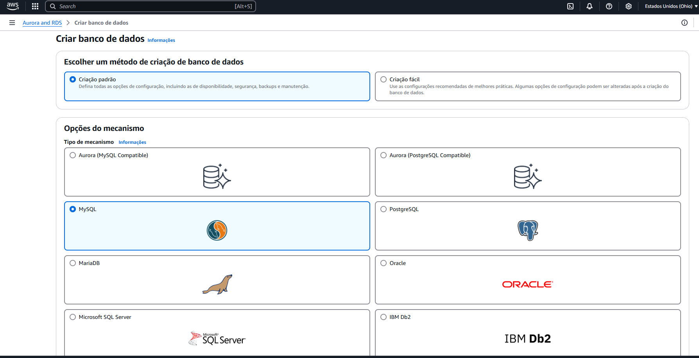  
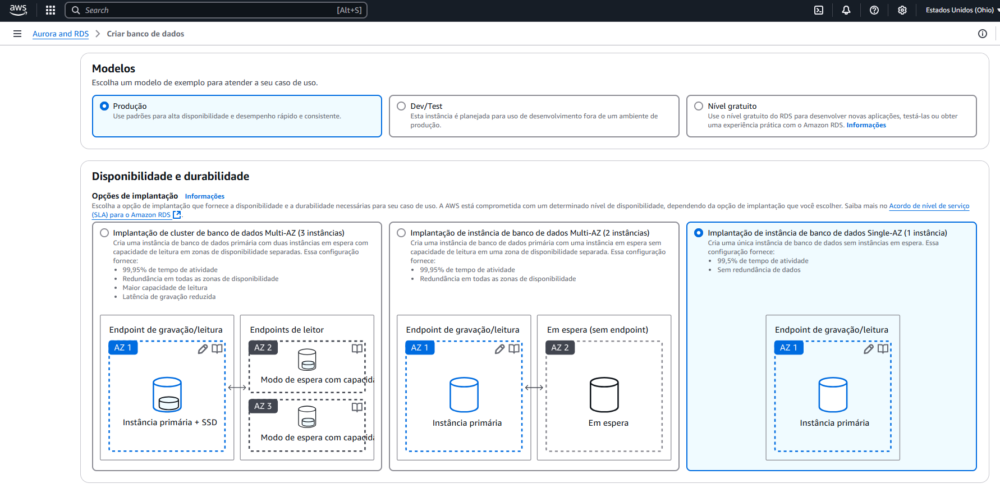  
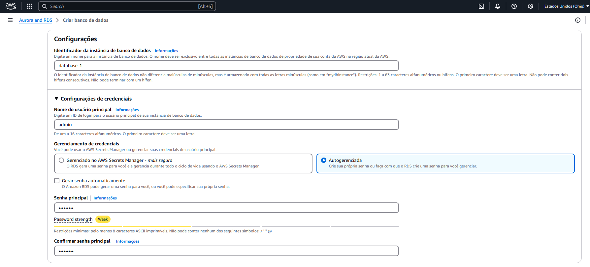  
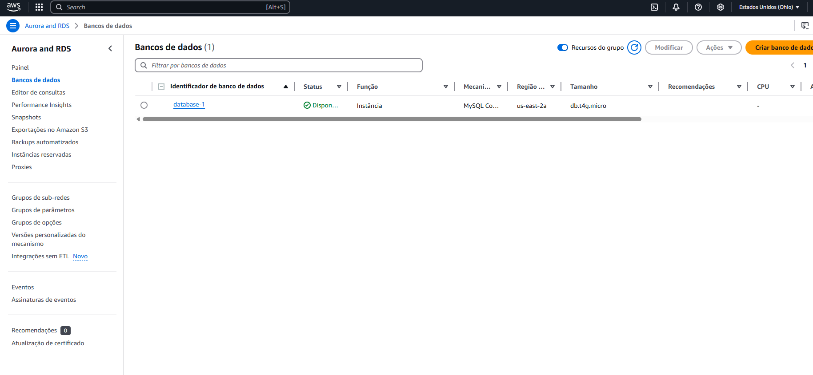  

---

## 2 - ⚙️ Setup do Ambiente Lambda e Dependências

**O que é?**  
AWS Lambda permite executar código sem provisionar servidores. Aqui, criaremos uma função Lambda que interage com o banco MySQL no RDS.

1. Crie uma nova pasta e posteriormente instale as depências do MySQL via CMD usando o comando abaixo.

📌 **Instale as dependências locais (no mesmo diretório (pasta) da função):**

```bash
pip install mysql-connector-python==8.0.26 -t .
```

📸  
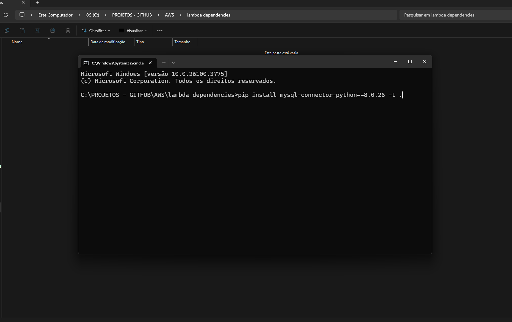

---

## 3 - 📦 Criação e Deploy da Função Lambda

1. No console AWS, crie uma nova função Lambda.
2. Escolha "Python" como runtime e configure permissões.
3. Compacte (ZIP) a pasta com a função `.py` + dependências (`mysql-connector-python`) e faça upload na função Lambda criada.

📸  
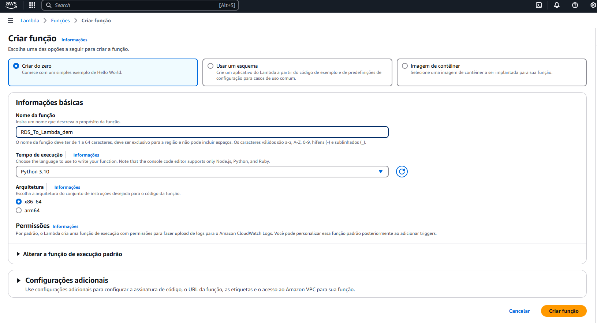  
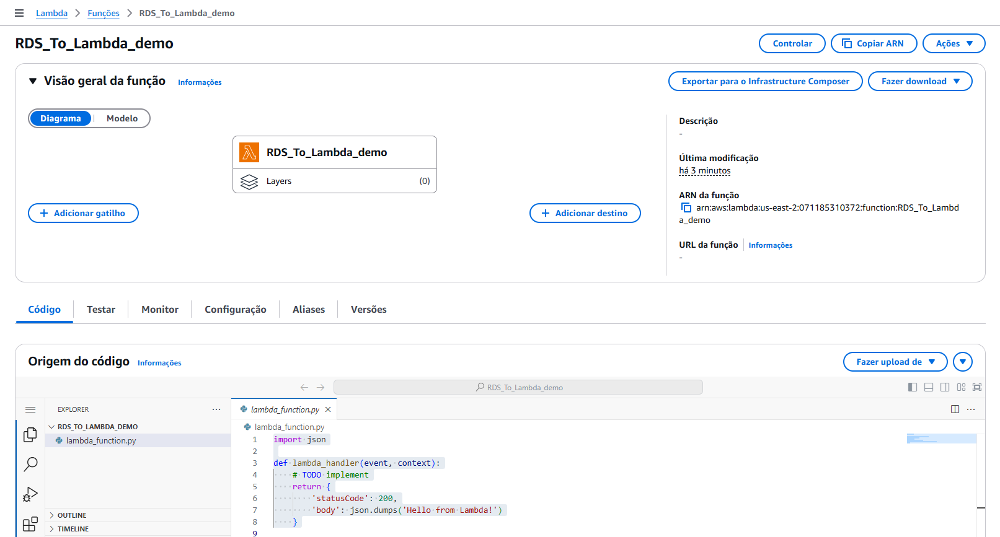  
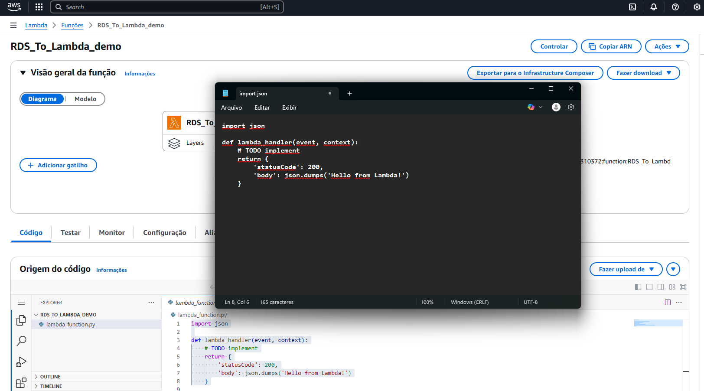  
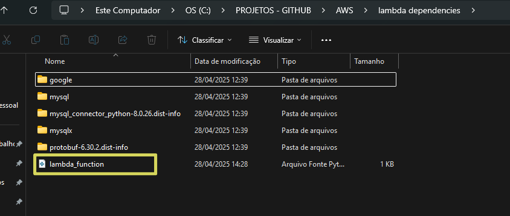  
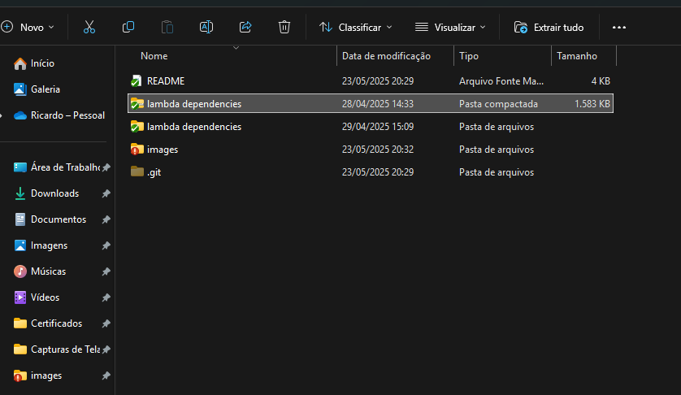  
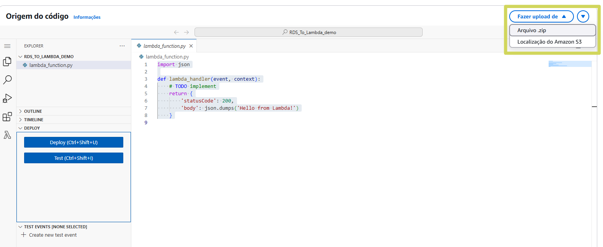

✅ **Teste inicial da função**:
Adicione `import mysql.connector` no início do código. Execute um teste simples — a resposta esperada é:

```json
{
  "statusCode": 200,
  "body": "Success!"
}
```

📸  
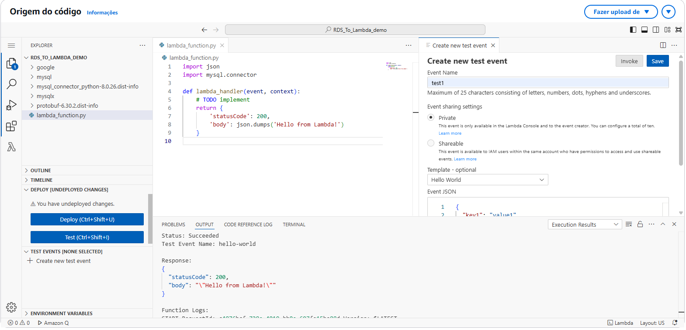

---

## 4 - 🔗 Conectando Lambda ao RDS

Utilize o endpoint do banco de dados RDS para conectar sua Lambda.

📌 **Exemplo básico de conexão**:

```python
import mysql.connector

cnx = mysql.connector.connect(
    user='admin',
    password='SENHA_DO_SEU_BANCO',
    host='endpoint-do-rds.amazonaws.com',
)
```

📸  
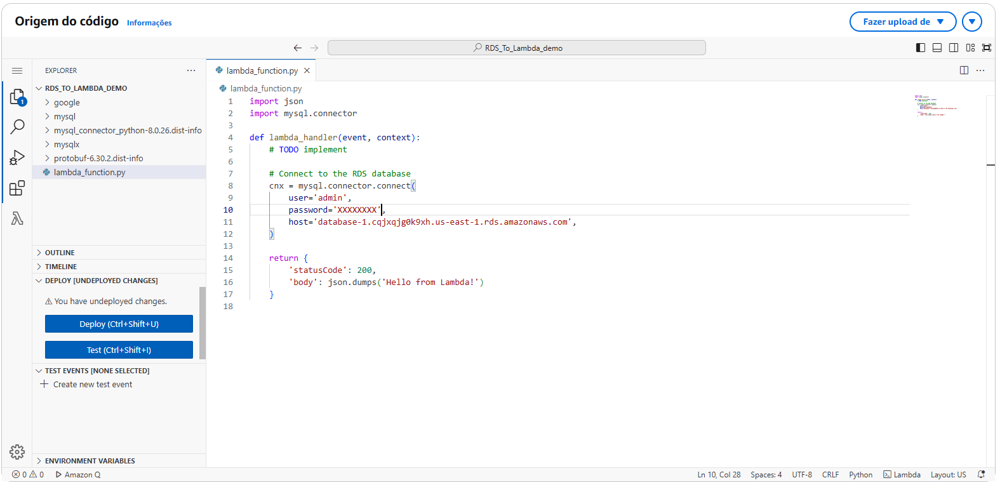

📌 **Criação de banco e tabela (caso não existam):**

```python
cursor = cnx.cursor()
cursor.execute("CREATE DATABASE IF NOT EXISTS mydatabase")
cursor.execute("USE mydatabase")

table_exists_query = "SHOW TABLES LIKE 'cool_stuff'"
cursor.execute(table_exists_query)
if not cursor.fetchone():
    cursor.execute("""
        CREATE TABLE cool_stuff (
            id INT AUTO_INCREMENT PRIMARY KEY,
            cool_data VARCHAR(255),
            coolness INT
        )
    """)
    cnx.commit()
```

📌 **Inserção de dados**:

```python
insert_query = "INSERT INTO cool_stuff (cool_data, coolness) VALUES (%s, %s)"
cursor.execute(insert_query, ("This is some cool data", 100))
cnx.commit()
cursor.close()
cnx.close()
```

---

## 5 - 🌐 Configuração do API Gateway

**O que é?**  
Amazon API Gateway permite expor sua Lambda como uma API RESTful.

📌 **Etapas**:
- Crie uma nova API.
- Defina rotas (ex: `GET /data`, `POST /insert`).
- Faça a integração com a função Lambda.
- Teste suas rotas diretamente no console.

📸  
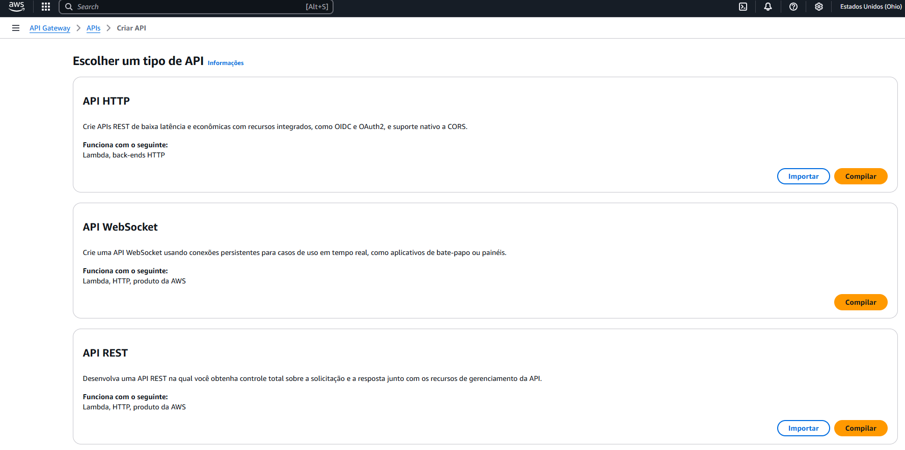  
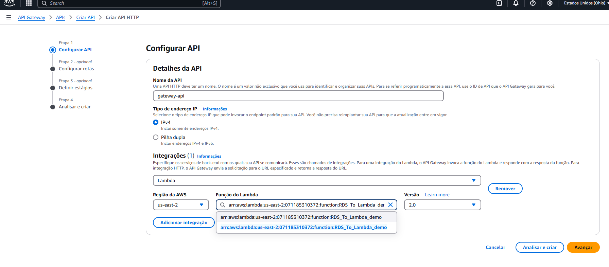  
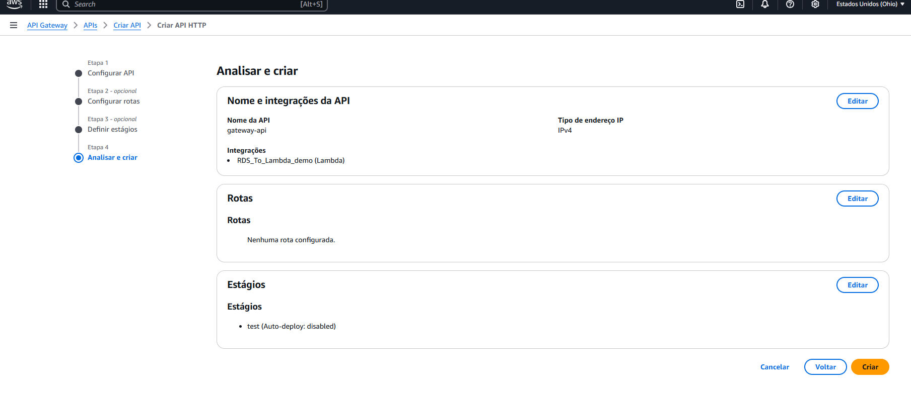  
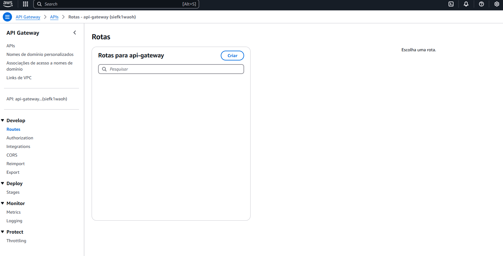  
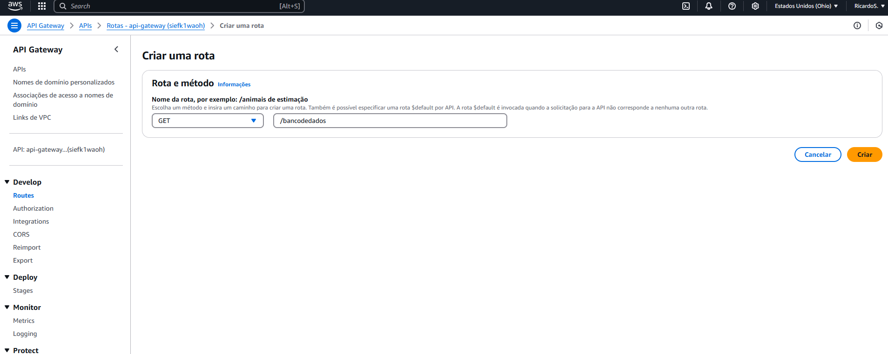  
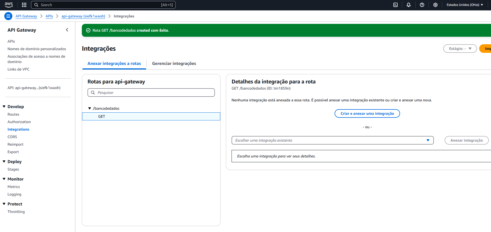  
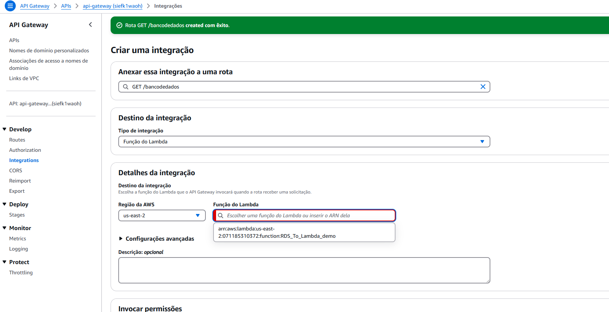  
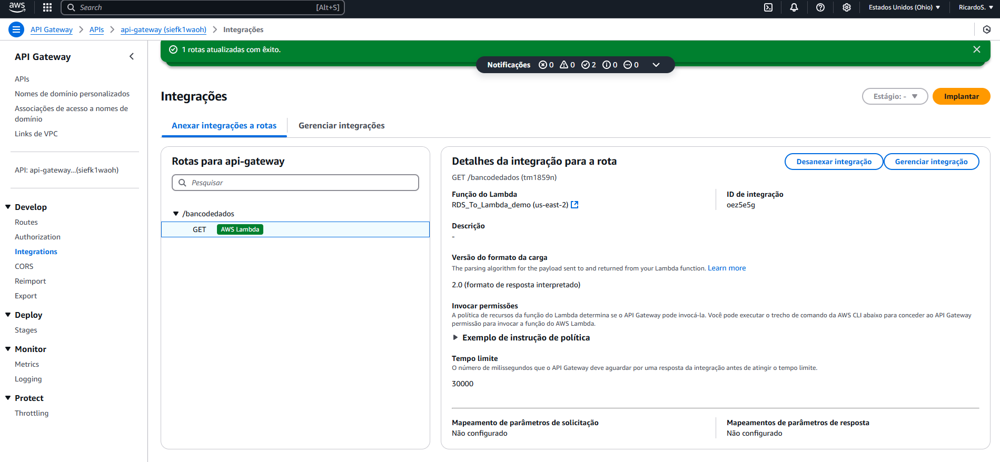

---

## ✅ Resultado Esperado

Após a configuração correta, você terá uma **API totalmente serverless** na AWS, com rotas REST que executam funções Python na Lambda, conectando-se ao MySQL no RDS e manipulando dados em tempo real.

---

## 🧩 Melhorias Futuras (Sugestões)

- Adicionar autenticação via AWS Cognito ou API Keys.
- Implementar monitoramento com CloudWatch.
- Criar estrutura de múltiplos ambientes (dev/staging/prod).
- Automatizar deploy com Terraform ou AWS SAM.

---

## 📌 Requisitos

- Conta AWS
- IAM com permissões adequadas
- Python 3.8+
- AWS CLI (opcional)
