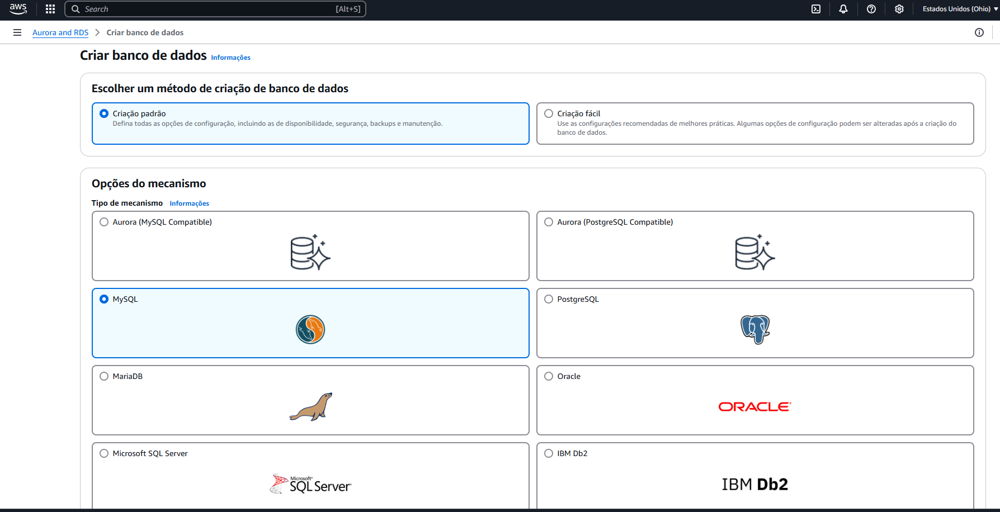
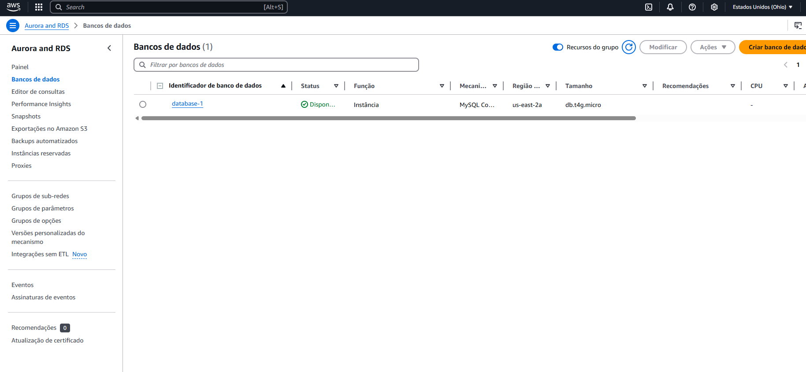
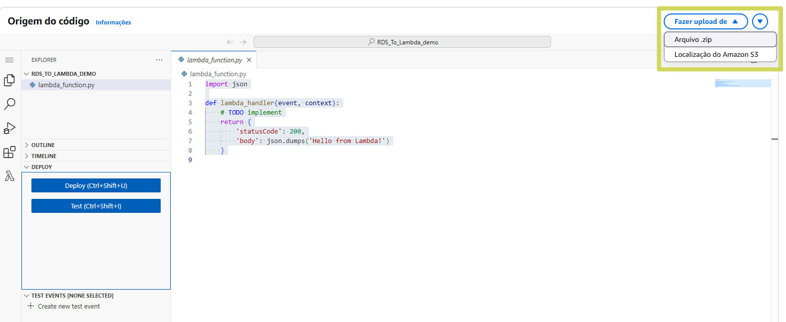
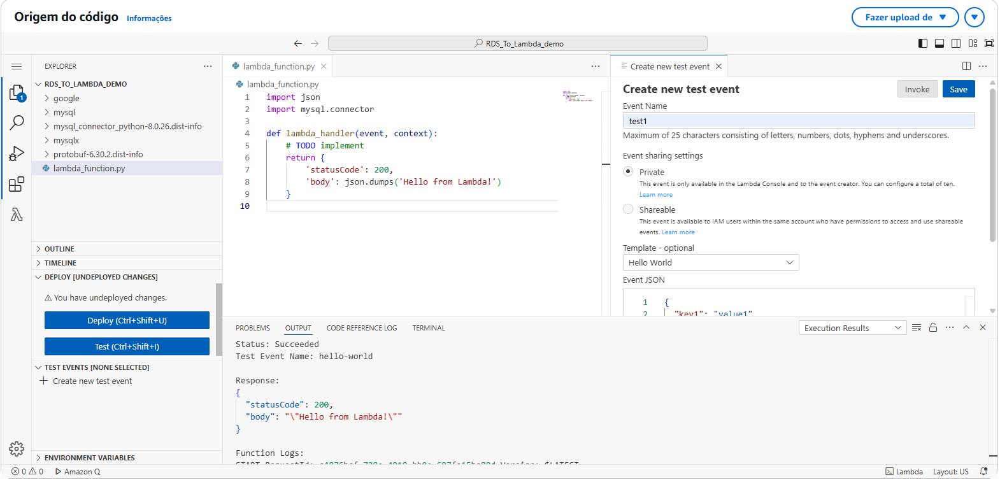
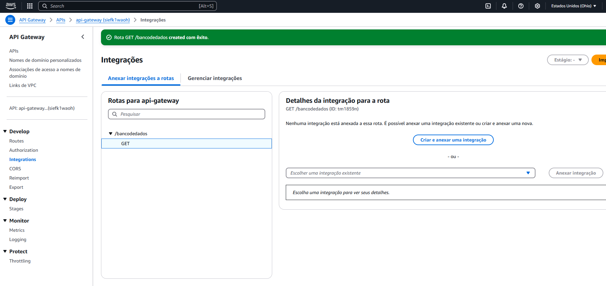

# Documentação - AWS

###  Passo a Passo para criação de Banco de dados / API Gateway

### 1 - Criação do Banco de Dados via Amazon RDS (Relational Database Service)

**Definição**: *O **Amazon RDS** é um serviço de banco de dados relacional na nuvem, gerenciado pela AWS, que facilita a configuração, operação e escalabilidade de bancos de dados relacionais. Ele oferece suporte a vários mecanismos de banco de dados, como **MySQL, PostgreSQL, MariaDB, SQL Server, Oracle e Db2**, permitindo que você utilize seu código, aplicações e ferramentas existentes.*

<br>






***

### 2 - Criar as dependências LAMBDA

**Definição**: ***AWS Lambda** é um serviço de computação sem servidor (serverless) da Amazon que permite executar código em resposta a eventos, sem precisar provisionar ou gerenciar servidores.
O código é executado automaticamente quando acionado por gatilhos como **API Gateway**, **eventos de banco de dados**, **uploads no S3**, entre outros.*

<br>

**Instalar as dependências do MySQL**

```comando
pip install mysql-connector-python==8.0.26 -t .
```


***

### 3 - Criar função Lambda na AWS


***

### 4 - Salvar função da Lambda (AWS) como um arquivo py dentro da pasta que foi instalada as dependências Lambda:


<br>

**- Posteriormente deve compactar a pasta das dependências da Lambda e realizar o upload na função Lambda criada na AWS:**





<br>

**Adcione a função: `import mysql.connector` a função e realize o teste da função, é esperado que retorne `'statusCode: 200'`:**



### 5 - Conectando ao RDS database

**- Adicione a função para realizar a conexão. Importante: o endereço 'host' está nas informações dos banco de dados que criou no RDS:**

```connect
# Connect to the RDS database
    cnx = mysql.connector.connect(
        user='admin', 
        password='XXXXXXXX',
        host='endpoint Amazon RDS',
    )
```


**OBS: Caso não tenha criado o banco de dados e queria criar para tese, apenas adicione o código abaixo:**

```
cursor = cnx.cursor()
    create_db_query = "CREATE DATABASE IF NOT EXISTS mydatabase"
    cursor.execute(create_db_query)

    cursor.close()
    cnx.close()
```

**Criar Tabela, caso não tenha criado:**

```
table_exists_query = "SHOW TABLES LIKE 'cool_stuff'"
    cursor.execute(table_exists_query)
    table_exists = cursor.fetchone()

    if not table_exists:
        create_table_query = "CREATE TABLE cool_stuff (id INT AUTO_INCREMENT PRIMARY KEY, cool_data VARCHAR(255), coolness INT)"
    cursor.execute(create_table_query)
    cnx.commit()
```

**Inserir valores na tabela:**

```
insert_query = "INSERT INTO cool_stuff (cool_data, coolness) VALUES (%s, %s)"
    insert_values = ("This is some cool data", 100)
    cursor.execute(insert_query, insert_values)
```

<br>

### 6 - Criando e Configurando a `API GATEWAY`:


**- Criando Rotas**


**- Criando Integração**




